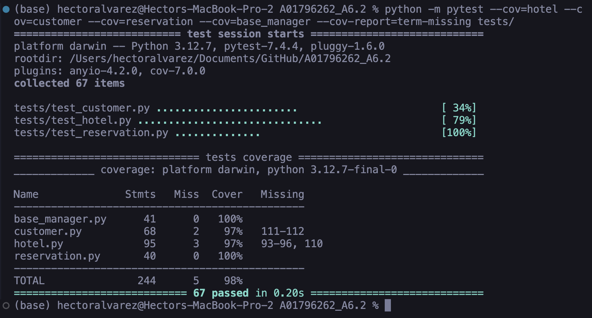
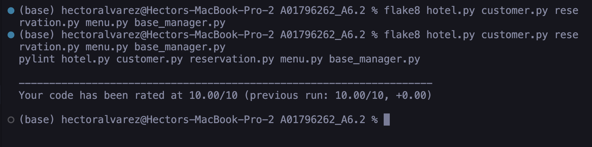

# A01796262_A6.2

Reservation System - Hotel, Customer, and Reservation management
with JSON persistence, unit tests, and PEP-8 compliance.

## Requirements

```bash
pip install -r requirements.txt
```

## Run the CLI

```bash
python menu.py
```

## Run Tests

```bash
python -m pytest tests/ -v
```

## Run Tests with Coverage

```bash
python -m pytest --cov=hotel --cov=customer --cov=reservation --cov=base_manager --cov-report=term-missing tests/
```

## Static Analysis

```bash
flake8 hotel.py customer.py reservation.py menu.py base_manager.py
pylint hotel.py customer.py reservation.py menu.py base_manager.py
```

## Evidence




